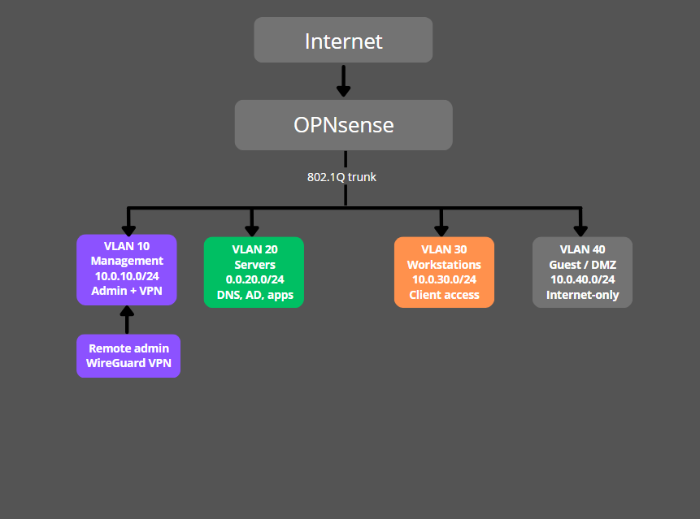

  
  <h1 align="center">Segmented Virtual Network Lab</h1>
  
OPNsense + VLAN + DHCP + DNS + VPN

  
  
## 📌 Project Description
### 🚧 Status: In progress
Building a segmented lab network with VLANs, DHCP/DNS, and WireGuard VPN using OPNsense.

📋 [See detailed build log](docs/progress.md)
